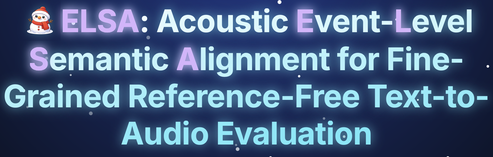
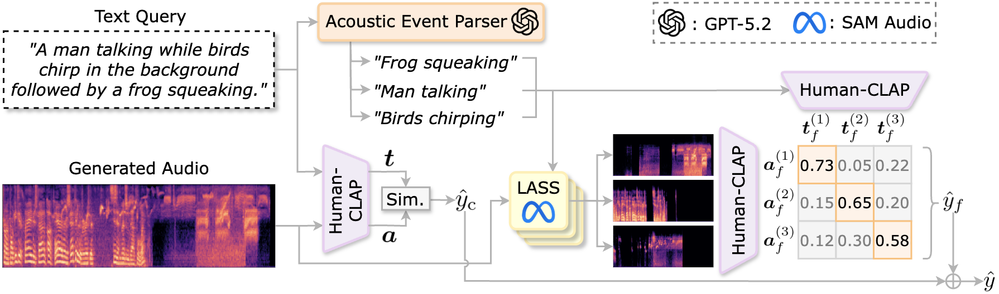

# ELSA: Event-Level Semantic Alignment for Audio

<div align="center">

[](https://elsa-projectpage.pages.dev)
[](https://arxiv.org)
</div>



## About This Project

ELSA is a novel framework for fine-grained, reference-free evaluation of text-to-audio generation models. By decomposing audio into semantic events and aligning them with textual descriptions at the event level, ELSA provides more accurate and interpretable evaluation metrics for audio generation quality.

**Key Features:**
- **Event-Level Alignment**: Breaks down audio into semantic events for precise alignment with text descriptions
- **Reference-Free Evaluation**: Eliminates the need for reference audio, enabling evaluation of diverse audio generation
- **Fine-Grained Analysis**: Provides detailed insights into which aspects of the generated audio match the text prompt

## Architecture



ELSA consists of three main components:

1. **Audio Event Encoder**: Extracts semantic events from generated audio using advanced audio understanding models
2. **Text Encoder**: Processes and encodes the input text descriptions
3. **Semantic Alignment Module**: Aligns audio events with text semantics to compute evaluation scores

## Environment Installation + Pretrained Model Download

### Prerequisites
- [uv](https://docs.astral.sh/uv/getting-started/installation/)
- CUDA 11.8+ (for GPU acceleration)
- 12GB+ VRAM (20GB+ recommended for some features)

### Installation

```bash
# Clone the repository
git clone git@github.com:kento2247/TTAEval.git
cd TTAEval
uv sync
```

### Download Pretrained Models

```bash
# Download pretrained models
sh scripts/download_model.sh
```

This will download:
- SAM-Audio model for audio segmentation
- CLAP embeddings for semantic understanding

## Data Download

```bash
# Download evaluation datasets
sh scripts/download_data.sh
```

Available datasets include:
- AudioCaps
- MusicCap
- Other benchmark datasets

For detailed information about dataset structure, refer to the data directory documentation.

## One-shot Evaluation (src/oneshot.py)

Run a single audio/text pair through the evaluation model:

```bash
python src/oneshot.py \
  --audio_file_path data/wav/tango/train/23.wav \
  --text "A dog barking and a car honking." \
  --metric REL
```

Arguments:
- `--audio_file_path`: Path to the input audio file.
- `--text`: Text description of the audio.
- `--metric`: Evaluation metric, `REL` or `OVL` (default: `REL`).

## Citation

```
Under Review
```

---
